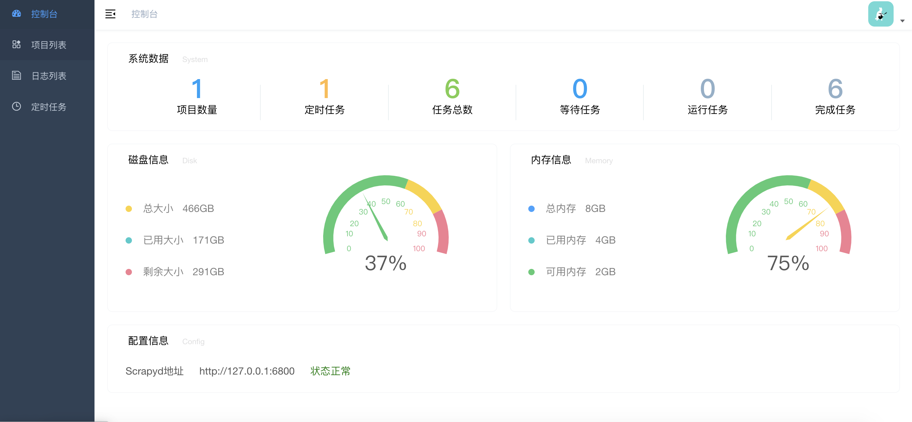
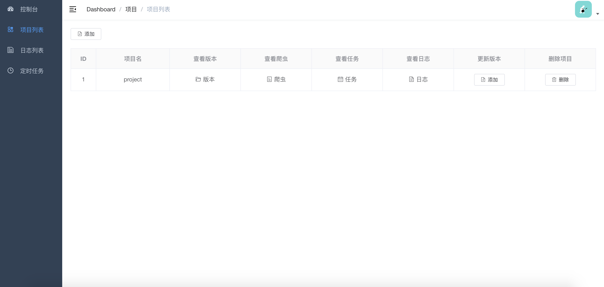
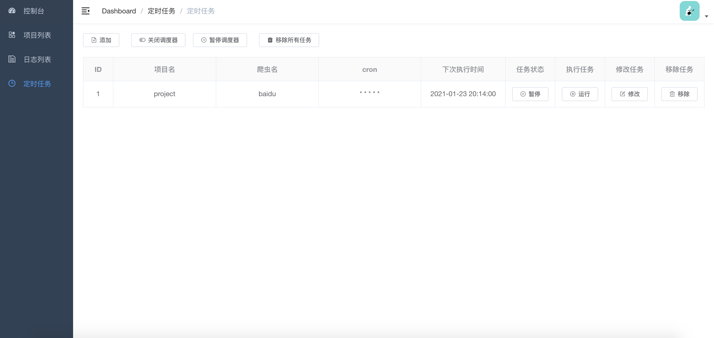
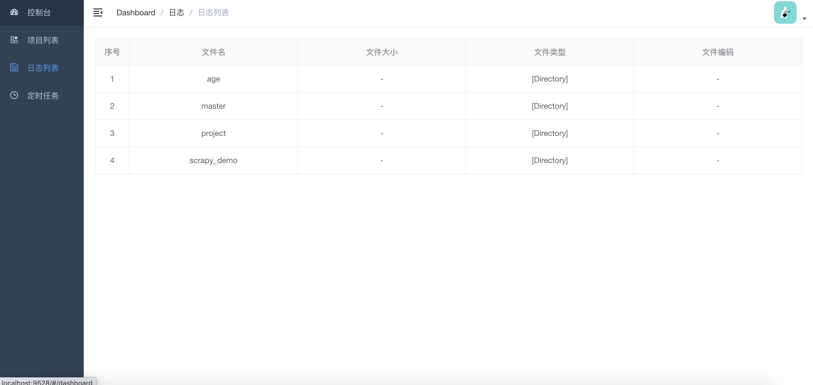

# Spider Admin Pro

Github: [https://github.com/mouday/spider-admin-pro](https://github.com/mouday/spider-admin-pro)

Gitee: [https://gitee.com/mouday/spider-admin-pro](https://gitee.com/mouday/spider-admin-pro)

Pypi: [https://pypi.org/project/spider-admin-pro](https://pypi.org/project/spider-admin-pro)

## 简介

Spider Admin Pro 是Spider Admin的升级版

1. 简化了一些功能；
2. 优化了前端界面，基于Vue的组件化开发；
3. 优化了后端接口，对后端项目进行了目录划分；
4. 整体代码利于升级维护。

## 安装启动

方式一：
```bash
$ pip install spider-admin-pro

$ python -m spider_admin_pro.run
```

方式二：
```bash
$ git clone https://github.com/mouday/spider-admin-pro.git

$ python spider_admin_pro/run.py

或者

$ gunicorn spider_admin_pro.run:app
``` 

## 配置参数

在运行目录新建 `.env` 环境变量文件，默认参数如下

注意：为了与其他环境变量区分，使用`SPIDER_ADMIN_PRO_`作为变量前缀

```bash

# flask 服务配置
SPIDER_ADMIN_PRO_PORT = 5002
SPIDER_ADMIN_PRO_HOST = '127.0.0.1'

# 登录账号密码
SPIDER_ADMIN_PRO_USERNAME = admin
SPIDER_ADMIN_PRO_PASSWORD = "123456"
SPIDER_ADMIN_PRO_JWT_KEY = FU0qnuV4t8rr1pvg93NZL3DLn6sHrR1sCQqRzachbo0=

# token过期时间，单位天
SPIDER_ADMIN_PRO_EXPIRES = 7

# scrapyd地址, 结尾不要加斜杆
SPIDER_ADMIN_PRO_SCRAPYD_SERVER = 'http://127.0.0.1:6800'

# 调度器 调度历史存储设置
# mysql or sqlite and other, any database for peewee support
SPIDER_ADMIN_PRO_SCHEDULE_HISTORY_DATABASE_URL = 'sqlite:///dbs/schedule_history.db'

# 调度器 定时任务存储地址
SPIDER_ADMIN_PRO_JOB_STORES_DATABASE_URL = 'sqlite:///dbs/apscheduler.db'

```

生成jwt key
```
$ python -c 'import base64;import os;print(base64.b64encode(os.urandom(32)).decode())'
```

## 技术栈：
1、前端技术：

|  功能 | 第三方库及文档  |  
| - | -  | 
| 基本框架 | [vue](https://cn.vuejs.org/)  |
| 仪表盘图表 | [echarts](https://echarts.apache.org/)  |
| 网络请求 | [axios](https://www.npmjs.com/package/axios)  |


2、后端技术

| 功能 | 第三方库及文档 |
| - | -  |
| 接口服务 | [Flask](https://dormousehole.readthedocs.io/) |
| 任务调度 | [apscheduler](https://apscheduler.readthedocs.io/) |
| scrapyd接口 | [scrapyd-api](https://github.com/mouday/scrapyd-api) |
| ORM | [peewee](http://docs.peewee-orm.com/) |
| jwt | [jwt](https://pyjwt.readthedocs.io/) |
| 系统信息 | [psutil](https://psutil.readthedocs.io/) |

## 项目结构

【公开仓库】基于Flask的后端项目spider-admin-pro: [https://github.com/mouday/spider-admin-pro-web/](https://github.com/mouday/spider-admin-pro)

【私有仓库】基于Vue的前端项目spider-admin-pro-web: [https://github.com/mouday/spider-admin-pro-web/](https://github.com/mouday/spider-admin-pro-web/)


spider-admin-pro项目结构：

```bash
.
├── __init__.py
├── run.py
├── main.py
├── config.py
├── version.py
├── flask_app.py
├── logger.py
├── api_result.py
├── api
│   ├── __init__.py
│   ├── auth_api.py
│   ├── schedule_api.py
│   ├── scrapyd_api.py
│   └── system_info_api.py
├── service
│   ├── __init__.py
│   ├── auth_service.py
│   ├── schedule_service.py
│   ├── scrapyd_service.py
│   └── system_data_service.py
├── model
│   ├── __init__.py
│   ├── base.py
│   └── history.py
├── exceptions
│   ├── __init__.py
│   ├── api_exception.py
│   └── constant.py
├── utils
│   ├── __init__.py
│   ├── jwt_util.py
│   ├── scheduler_util.py
│   ├── sqlite_util.py
│   └── system_info_util.py
└── web
    ├── __init__.py
    ├── main.py
    └── public
        ├── index.html
        └── static
```
## 项目截图










## TODO

1. 补全开发文档
2. 支持命令行安装可用
3. 优化代码布局，提取公共库
